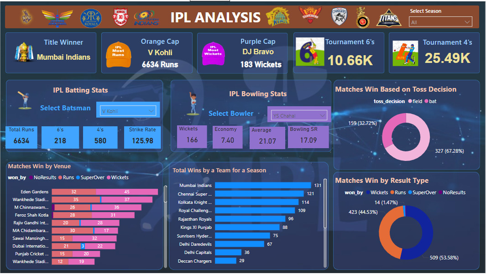

# IPL Analysis using Power BI
## Project Description
The IPL Analysis Dashboard provides an interactive and visually appealing way to analyze Indian Premier League (IPL) data. The project aims to demonstrate key data analysis techniques, including data cleaning, processing, modeling, and creating insightful visualizations. Microsoft SQL Server was used for data processing, and Power BI was employed to design an intuitive dashboard that offers critical insights.

This project highlights various functionalities of Power BI, from importing raw data into Microsoft SQL Server to generating meaningful reports through data modeling, DAX calculations, and dynamic visualizations.

## Table of Contents
1. Project Description
2. Features
3. Technologies Used
4. Installation
5. Usage
6. Project Insights
7. Skills Demonstrated
8. Credits

## Features
- Interactive dashboard showcasing key IPL metrics
- Import and processing of raw data from PostgreSQL and MS SQL Server
- Data cleaning and transformation using Power Query Editor
- Data modeling and relationship building within Power BI
- KPI design and calculation using DAX (Data Analysis Expressions)
- Dynamic charts, filters, and slicers for better data exploration

## Technologies Used
- Microsoft Power BI: For data visualization and dashboard creation
- Microsoft SQL Server: Used for data storage and processing
- PostgreSQL: For raw data storage and retrieval
- DAX (Data Analysis Expressions): For calculations and creating custom measures in Power BI
- Power Query Editor: For data cleaning and transformations

## Installation
To run this project locally:
1. Clone the repository to your local machine.
2. Install Power BI Desktop.
3. Ensure you have access to a PostgreSQL or Microsoft SQL Server instance to connect your data source.
4. Open the Power BI file and follow the instructions to connect to your data source.

## Steps:
1. Import raw data into PostgreSQL and MS SQL Server.
2. Connect Power BI to these databases.
3. Import raw data from both databases into Power BI.
4. Clean and process the data using Power Query Editor.
5. Build data models and create relationships between tables.
6. Use DAX for creating measures, KPIs, and calculations.
7. Design dynamic visualizations using Power BI's wide range of charts, slicers, and filters.

## Usage
The dashboard allows users to:
Filter IPL data by teams, players, and seasons
View KPIs such as total runs, wickets, strike rates, and economy rates
Explore various charts representing player and team performances
Analyze data trends with dynamic charts, slicers, and filters

## View the dashboard

## Project Insights
The analysis focused on various IPL performance metrics such as:

- Team and individual player statistics
- Match performance breakdowns
- Insights into top performers based on runs, wickets, and more
- Filtering data by season, player, and team

## Skills Demonstrated
- Data Import and Connection: Connected Power BI to MS SQL Server and PostgreSQL databases to import raw data.
- Data Cleaning: Used Power Query Editor to clean and transform raw data, ensuring that it was in the right format for analysis.
- Data Modeling: Created relationships between multiple data tables and performed data modeling to build a structured data model for analysis.
- DAX: Used DAX for advanced calculations, including KPIs and measures such as total runs, strike rates, and wickets.
- Visualization and Reporting: Created dynamic and interactive charts, slicers, and filters to allow for in-depth exploration of IPL data.
- Dashboard Design: Designed an intuitive and visually appealing dashboard that presents key IPL statistics and insights in a clear and concise manner.

